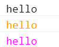

### Console.log For Vue

```bash
import vLog from 'v-log'

Vue.use(vLog)

```
### Temaplate Script
```bash
vue 1.0+
ready(){
  this.$log('hello');   // default
  this.$log('hello',1); // info
  this.$log('hello',2); // warn
}

vue 2.0+
mounted(){
  this.$log('hello');   // default
  this.$log('hello',1); // info
  this.$log('hello',2); // warn
}

```

### Font Color
